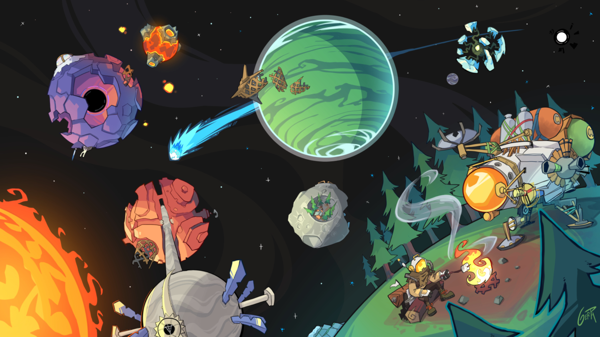

  

  <h1>Hi there, I'm Vaiditya Tanwar 👋</h1>

## About Me

I'm a passionate Competitive Coder with a love for open-source projects and community collaboration. I specialize in Artificial Intelligence and have experience working with a variety of technologies.

- 🔭 I’m currently working on [Codemelon](https://github.com/codemelonxyz)
- 🌱 I’m currently learning **Machine Learning and AI**
- 👯 I’m looking to collaborate on **Open Source Projects**
- 💬 Skills **MERN Stack, AI, CPP, Java, Competitive Programming**
- 📫 How to reach me: [Mail](mailto:vaidityatanwar2207@gmail.com)

## Skills

### Languages

### Frameworks and Libraries

### Tools 

## GitHub Stats

## Connect with Me

